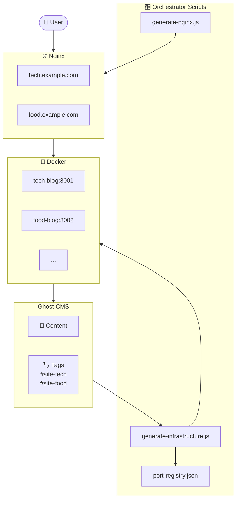
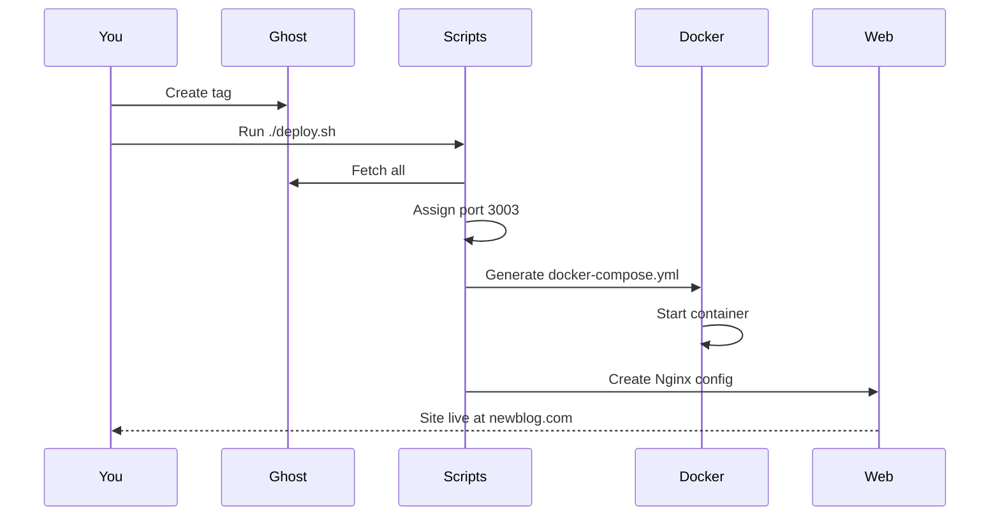

# CMS-to-Astros

**Automatically spin up websites from Ghost CMS tags.**

Write content in Ghost, tag it with `#site-food` or `#site-tech`, and this system will automatically create and deploy a new website for that tag.

---

## Architecture



## Workflow



---

## Quick Start

### 1. Configure

```bash
cd generator
cp .env.example .env
```

Edit `.env` with your Ghost credentials:
```env
GHOST_URL=https://your-ghost.com
GHOST_ADMIN_KEY=abc123:def456...
GHOST_CONTENT_KEY=xyz789...
```

### 2. Create a Tag in Ghost

| Field | Value |
|-------|-------|
| **Name** | `#site-tech` |
| **Description** | `domain=tech.example.com; image=my-astro-image:latest` |

### 3. Deploy

```bash
./deploy.sh
```

This runs:
1. `generate-infrastructure.js` → Creates `docker-compose.generated.yml`
2. `docker compose up -d` → Starts containers
3. `generate-nginx.js` → Creates Nginx configs (requires sudo)

### 4. SSL (Optional)

```bash
sudo certbot --nginx -d tech.example.com
```

---

## Directory Structure

```
├── generator/
│   ├── generate-infrastructure.js   # Scans Ghost, assigns ports
│   ├── generate-nginx.js            # Creates Nginx configs
│   ├── nightly-archive.sh           # Static HTML backup
│   ├── port-registry.json           # Port assignments (auto-created)
│   └── .env                          # Your API keys
│
├── app/
│   └── src/lib/ghost.ts             # Ghost API client for Astro
│
├── archives/                         # Static builds go here
├── deploy.sh                         # Master deployment script
├── crontab.example                   # Nightly archival cron
└── docker-compose.generated.yml      # Auto-generated
```

---

## Scripts Reference

| Script | Purpose | Run As |
|--------|---------|--------|
| `generate-infrastructure.js` | Reads Ghost tags, assigns ports, writes Docker Compose | User |
| `generate-nginx.js` | Creates `/etc/nginx/sites-available/*` configs | Root |
| `nightly-archive.sh` | Builds static HTML snapshots to `/archives` | User (cron) |
| `deploy.sh` | Runs all of the above in order | User + sudo |

---

## Nightly Archival

Add to crontab (`crontab -e`):

```cron
0 3 * * * cd /path/to/CMS-to-Astros && ./generator/nightly-archive.sh >> /var/log/cms-archive.log 2>&1
```

This builds static HTML versions of all sites nightly for archival/backup.

---

## Ghost Tag Format

The tag **Description** field controls deployment:

```
domain=myblog.com; image=ghcr.io/user/myblog:latest
```

| Key | Purpose |
|-----|---------|
| `domain` | Public domain for Nginx routing |
| `image` | Docker image to use (allows different codebases per site) |

---

## License

MIT
